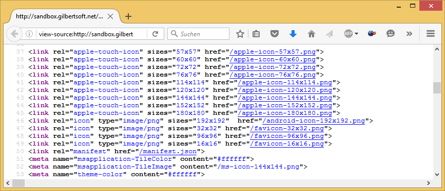

.. ==================================================
.. FOR YOUR INFORMATION
.. --------------------------------------------------
.. -*- coding: utf-8 -*- with BOM.

.. include:: ../Includes.txt

.. _introduction:

Introduction
============

.. _what-it-does:

What does it do?
----------------

GS Favicon allows you to use favicons generated at `http://www.favicon-generator.org/ <http://www.favicon-generator.org/>`_ with the 
`Bootstrap Package <https://typo3.org/extensions/repository/view/bootstrap_package>`_.
The package will alter the setup field for you and with the constant editor in the template you are able to
define the favicons path as well as the "msapplication-TileColor" and "theme-color" tags. Make sure you include the
extension to your template after the Bootstrap Package.

.. _screenshots:

Screenshots
-----------

This is the screenshot after including the package to your site.

   GS Favicon Package just after installation

   The HTML source after the installation includes now the additional tags for your generated favicons
